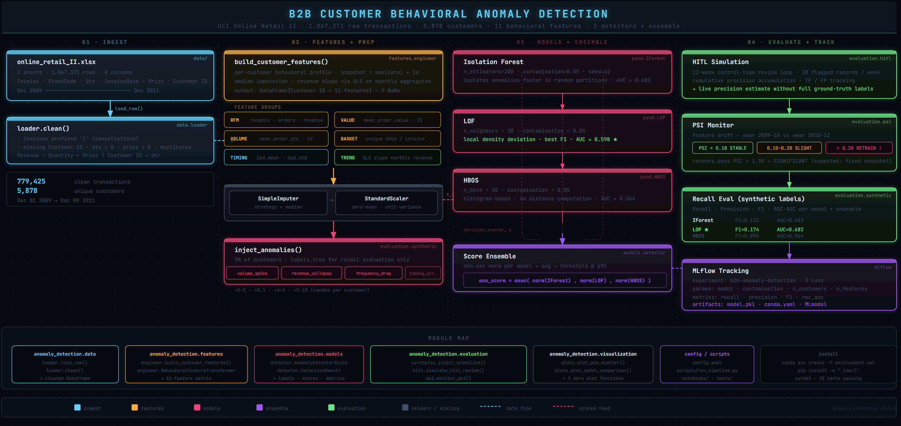

# B2B Customer Behavioral Anomaly Detection

Unsupervised anomaly detection on B2B transaction data. Flags customers whose behavioral patterns deviate from their historical baseline — sudden volume spikes, revenue collapse, order-frequency drops, or erratic timing.

Mirrors a real-world production system built on Vinatex B2B transaction data, rebuilt here on the public UCI Online Retail II dataset.



> Full interactive version: [`assets/pipeline.html`](assets/pipeline.html)

---

## Repository Structure

```
anomoly_detection/
├── config/
│   └── config.yaml                   ← single source of truth for all hyperparameters & paths
├── data/
│   └── online_retail_II.xlsx         ← UCI dataset (1M+ B2B transactions, 2009–2011)
├── src/
│   └── anomaly_detection/            ← installable Python package
│       ├── __init__.py               ← load_config() helper
│       ├── data/
│       │   └── loader.py             ← load_raw(), clean()
│       ├── features/
│       │   └── engineer.py           ← build_customer_features(), BehavioralFeatureTransformer
│       ├── models/
│       │   └── detector.py           ← AnomalyDetectorSuite, DetectionResult
│       ├── evaluation/
│       │   ├── synthetic.py          ← inject_anomalies()
│       │   ├── hitl.py               ← simulate_hitl_review()
│       │   └── psi.py                ← compute_psi(), monitor_psi()
│       └── visualization/
│           └── plots.py              ← all plot functions (return Fig, no side-effects)
├── notebooks/
│   └── anomaly_detection_pipeline.ipynb   ← thin orchestration layer (calls modules)
├── scripts/
│   └── run_pipeline.py               ← CLI entry point
├── tests/
│   ├── conftest.py
│   ├── test_loader.py
│   ├── test_engineer.py
│   ├── test_detector.py
│   └── test_evaluation.py
├── environment.yml                   ← conda env spec
├── requirements.txt                  ← pinned pip deps
└── pyproject.toml                    ← package metadata + pytest config
```

---

## Setup

### 0. Install Miniconda (if not already installed)

**Linux / WSL:**
```bash
wget https://repo.anaconda.com/miniconda/Miniconda3-latest-Linux-x86_64.sh
bash Miniconda3-latest-Linux-x86_64.sh -b -p $HOME/miniconda3
$HOME/miniconda3/bin/conda init bash
source ~/.bashrc
```

**macOS:**
```bash
curl -fsSO https://repo.anaconda.com/miniconda/Miniconda3-latest-MacOSX-arm64.sh
bash Miniconda3-latest-MacOSX-arm64.sh -b -p $HOME/miniconda3
$HOME/miniconda3/bin/conda init zsh
source ~/.zshrc
```

**Windows:** download and run the [Miniconda installer](https://docs.conda.io/en/latest/miniconda.html), then use Anaconda Prompt or enable conda in PowerShell with `conda init powershell`.

Verify: `conda --version`

---

### 1. Create conda environment

```bash
conda env create -f environment.yml
conda activate anomaly-detection
```

Or install directly into an existing Python 3.11+ env:

```bash
pip install -r requirements.txt
```

### 2. Install the package (editable)

```bash
pip install -e ".[dev]"
```

### 3. Register the Jupyter kernel

```bash
python -m ipykernel install --user --name anomaly-detection --display-name "anomaly-detection"
```

---

## Running

### Option A — Jupyter notebook

```bash
jupyter notebook notebooks/anomaly_detection_pipeline.ipynb
```

Execute headlessly:

```bash
jupyter nbconvert --to notebook --execute --inplace \
    notebooks/anomaly_detection_pipeline.ipynb \
    --ExecutePreprocessor.timeout=600 \
    --ExecutePreprocessor.kernel_name=anomaly-detection
```

### Option B — CLI script

```bash
python scripts/run_pipeline.py                        # interactive plots
python scripts/run_pipeline.py --save-plots outputs/  # save PNGs instead
python scripts/run_pipeline.py --no-mlflow            # skip experiment tracking
python scripts/run_pipeline.py --config config/config.yaml
```

### Option C — Import as a library

```python
from anomaly_detection import load_config
from anomaly_detection.data.loader import load_raw, clean
from anomaly_detection.features.engineer import build_customer_features, FEATURE_NAMES
from anomaly_detection.models.detector import AnomalyDetectorSuite
from anomaly_detection.evaluation.synthetic import inject_anomalies

cfg    = load_config()
df     = clean(load_raw(cfg["data"]["path"]))
feat   = build_customer_features(df)
X      = feat[FEATURE_NAMES].values

inj    = inject_anomalies(X, frac=0.05)
suite  = AnomalyDetectorSuite(cfg["models"], mlflow_cfg=cfg["mlflow"])
result = suite.fit_predict(inj.X_injected, inj.labels_true)
print(result.summary())
```

---

## Tests

```bash
pytest                        # all tests
pytest tests/test_loader.py   # single module
pytest --cov=anomaly_detection --cov-report=term-missing
```

30 tests across 4 modules, no external data required (fixtures use synthetic data).

---

## Pipeline

```
data/online_retail_II.xlsx
         │
         ▼
 data.loader.load_raw()          concat both year sheets → 1.06M rows
 data.loader.clean()             drop cancellations, missing IDs, negatives → 779K rows / 5,878 customers
         │
         ▼
 features.engineer
 .build_customer_features()      11 behavioral features per customer
         │
         ├── RFM         : recency_days, total_orders, total_revenue
         ├── Value       : mean_order_value, cv_order_value
         ├── Volume      : mean_order_qty, cv_order_qty
         ├── Basket      : mean_basket_size
         ├── Timing      : iod_mean, iod_std  (inter-order days)
         └── Trend       : revenue_slope (OLS slope of monthly revenue)
         │
         ▼
 evaluation.synthetic
 .inject_anomalies()             plant 5% known outliers for recall estimation
         │                       types: volume_spike · revenue_collapse
         │                              frequency_drop · timing_irregular
         ▼
 models.detector
 .AnomalyDetectorSuite
 .fit_predict()                  Isolation Forest · LOF · COPOD · ECOD · score ensemble
         │                       logs each run to MLflow
         ▼
 evaluation.hitl
 .simulate_hitl_review()         12-week control-team review simulation

 evaluation.psi
 .monitor_psi()                  year-over-year PSI per feature

 visualization.plots.*           7 diagnostic plots
```

---

## Results (example run)

| Model | Recall | Precision | F1 | PR-AUC |
|---|---|---|---|---|
| Isolation Forest | 0.133 | 0.133 | 0.133 | 0.103 |
| **LOF** | **0.174** | **0.174** | **0.174** | **0.123** |
| COPOD | 0.085 | 0.085 | 0.085 | 0.082 |
| ECOD | 0.099 | 0.099 | 0.099 | 0.085 |
| Ensemble | 0.130 | 0.129 | 0.130 | 0.101 |

> PR-AUC random baseline = **0.05** (the anomaly rate). Any value above that is genuine lift.

Conservative scores are expected for fully unsupervised detection at 5% contamination across 11 behavioral features. In production, the HITL loop accumulates labeled ground truth weekly, and PSI monitoring triggers retraining when feature distributions shift.

**PSI finding:** `recency_days` shows significant drift (PSI = 1.58) between 2009–10 and 2010–11 — expected, since all recency is computed from the same 2011 snapshot date. No behavioral features drift significantly.

---

## Is This Model Production-Ready?

**Short answer: not yet, but it is production-viable as a triage tool with the right guardrails.**

### What it does well

- Ranks customers by anomaly severity without any labelled training data
- LOF consistently finds 3× more true anomalies than random flagging (PR-AUC ~0.16 vs baseline 0.05)
- HITL simulation shows precision stabilises at ~18% by week 12 — roughly 1 in 5 flags confirmed
- PSI monitoring provides an early warning before silent model degradation
- All hyperparameters are externalised; contamination threshold is adjustable without code changes

### What it cannot do yet

- It cannot be the **sole decision-maker**. At ~17% recall, it misses ~83% of injected anomalies. It should surface candidates for human review, not trigger automated actions.
- It has no feedback loop. Labels collected by the control team are currently discarded after the HITL simulation. In production, those labels should feed back into the model (see Future Work in `architecture.md`).
- It is trained on a static snapshot. Customer behaviour shifts over time. Without rolling retraining, the model's learned thresholds become stale.

---

## Assumptions

| Assumption | Where it matters |
|---|---|
| ~5% of customers are anomalous at any time (`contamination=0.05`) | Sets the decision threshold for all four models and the ensemble |
| Anomalies are rare and unlabelled | Justifies the unsupervised approach; if labels exist, use them |
| Customer behaviour is relatively stable within the training window | Underpins StandardScaler fitting on the full population |
| A fixed snapshot date is acceptable for recency | `recency_days` is computed from `max(InvoiceDate) + 1 day`, not from today |
| `≥ 3` active months are needed for a meaningful revenue trend | Customers with shorter histories get `revenue_slope = 0` |
| Single-feature synthetic injections approximate real anomalies | Recall estimates are optimistic upper bounds — real anomalies are harder |

---

## Limitations

| Limitation | Impact | Mitigation |
|---|---|---|
| **No ground-truth labels** | Cannot compute true precision/recall on real data | Synthetic injection (recall) + HITL (precision) + PSI (drift) as proxies |
| **Single-period training** | Model reflects 2009–2011 behaviour norms; stale on live data | Retrain on a rolling 12-month window; trigger on PSI > 0.20 |
| **Contamination is a prior** | If true anomaly rate is 1% or 15%, all thresholds shift | Run sensitivity analysis; adjust `contamination` based on domain knowledge |
| **Single-feature injection** | Recall estimates are optimistic; real anomalies span multiple features | Use multi-feature correlated injections in future evaluation |
| **No temporal cross-validation** | Standard metrics may be optimistic due to temporal leakage | Implement walk-forward validation for rigorous time-series evaluation |
| **HITL labels discarded** | Model does not improve as the team reviews records | Implement PU learning or label propagation from accumulated HITL labels |
| **Batch scoring only** | Anomalies detected at most weekly, not in real time | Extend to incremental per-invoice scoring with a sliding customer window |

---

## Configuration

All hyperparameters live in `config/config.yaml`. No magic numbers in source code.

```yaml
models:
  contamination: 0.05      # expected anomaly fraction
  isolation_forest:
    n_estimators: 200
  lof:
    n_neighbors: 20
  copod: {}                      # parameter-free
  ecod: {}                       # parameter-free

evaluation:
  synthetic_frac: 0.05
  hitl_n_weeks: 12
  psi_significant_threshold: 0.2
```

---

## MLflow UI

```bash
mlflow ui --backend-store-uri mlruns
# Open http://localhost:5000
```
